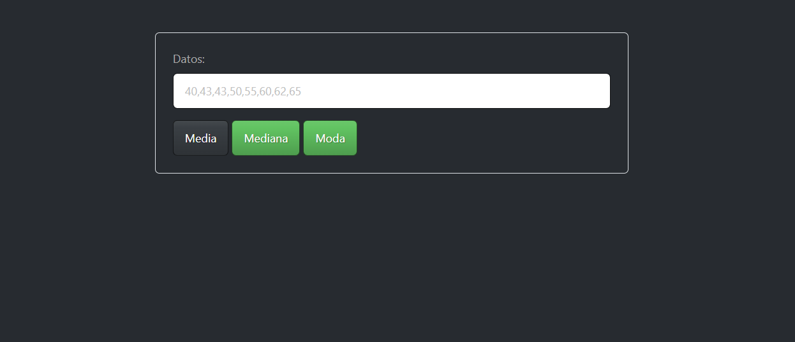
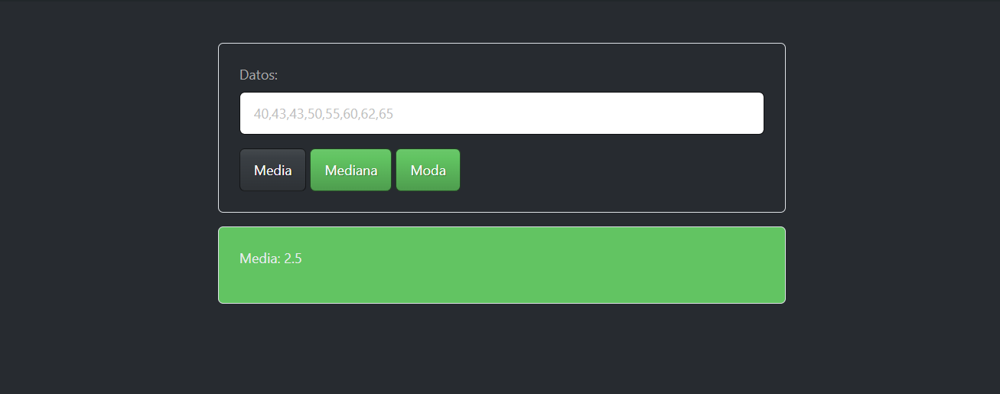

# Calculadora de media mediana y moda

    Esta es una sencilla calculadora desarrollada en HTML y JavaScript que permite calcular la edia, la mediana y la moda mediante un conjunto no agrupado de números.
    Es una útil herramienta para quienes necesitan realizar cálculos estadísticos de manera rápid y eficiente.

## uso 

1. Ingresar el conjunto de numeros como por ejemplo: "1,2,3,4"

2. Seleccionar la opción de la medida que desee calcular.

## Resultado de ejemplo:

